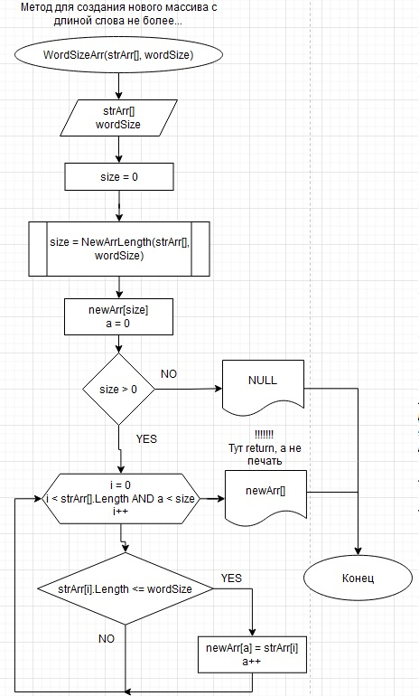

# Итоговая работа
*Задание: написасть программу, которая формирует новый массив из элементов строкового массива на входе, при том все элементы нового массива имею длину не более 3-х знаков.*

## Общее описание принципа решения
Программа состоит из следующих этапов:
1. Ввод начального массива (вводит пользователь).
2. Нахождение количества элементов соответсвующей длины, т.е. определяется размер нового массива.
3. В новый массив записываются подходящие элементы старого в порядке возрастания их индекса (индекс первоначального массива).
4. Печать в терминал нового массива.

## Блок схемы методов, созданных для решения
_Метод определения размера нового массива_

_Метод для заполнениея нужного массива_*

* *В приведенном методе идет обращение к первому методу*

_Итоговая программа_

Т.к. возможна ситуация, когда нет элементов удовлетворяющих нашим условиям, то вместо массива мы получим **NULL** и выведем соответсвующее сообщение.

